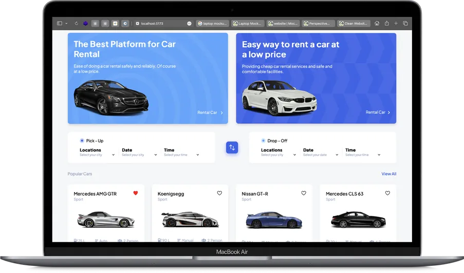

<h2 align="center">
  Caraie - v1.8 
</h2>
 

 

 &nbsp;

<!--  &nbsp; -->

 &nbsp;

<h3 align="center">
    🔹
    <a href="https://github.com/Zephinax/Portfolio/issues">Report Bug</a> &nbsp; &nbsp;
    🔹
    <a href="https://github.com/Zephinax/Portfolio/issues">Request Feature</a>
</h3>

## What is Caraie?

Caraie is car rental platform template made with react and type-script

<!--
## Features

- 📱 Fully Responsive

- 🖇️ Working Contact Form

- 📖 Multi-Page Layout

- 🔅 Dark & Light Mode

- 💄 Fully Customizable -->

Give a ⭐ if you like this project!

## Authors

- [@Zephinax](https://github.com/Zephinax)

  Please give me proper credit by linking back to [Me](https://github.com/Zephinax), Thanks!
