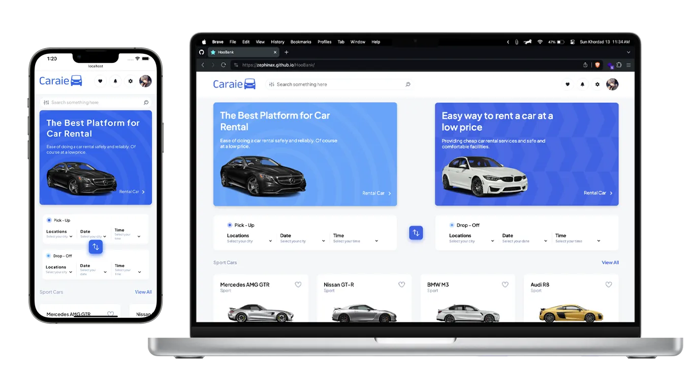

# Caraie - Car Rental Website Template



### ⚠️ **All names, information and assets used are fake and do not represent a real componany.** ⚠️

## Live Demo

### Take a look the live demo here 👉 [Zephinax.Caraie.ir](https://zephinax.github.io/HooBank/)

Embark on a dynamic car rental journey with our innovative platform powered by React & TypeScript, where every click opens the door to endless possibilities!

## Layout

- Navbar
- Home Page
- Category
- Car detail
- Footer

## Features

- Fully Responsive Design
- User Friendly Navigation

## Built With

- React.js
- Typescript
- Vite

## How to install

1. Clone this repository:

```bash
git clone https://github.com/Zephinax/Caraie.git
```

2. Go into project

```bash
cd Caraie
```

3. Install dependencies

```bash
npm install
```

4. Run project

```bash
npm run dev
```

Give a ⭐ if you like this project!

## Authors

- [@Zephinax](https://github.com/Zephinax)

  Please give me proper credit by linking back to [Me](https://github.com/Zephinax), Thanks!
